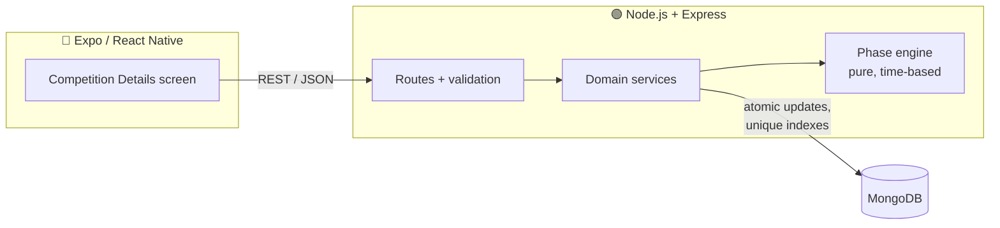
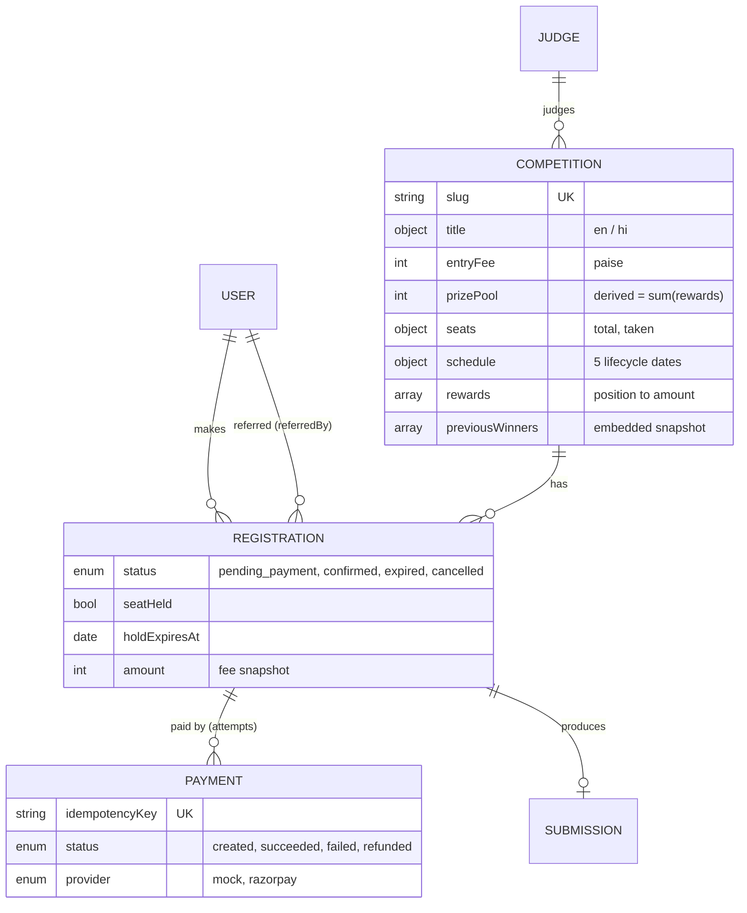
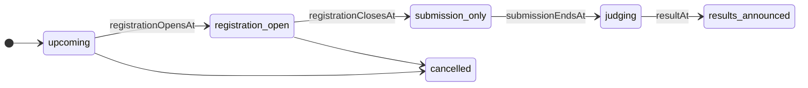

# Feedants Competition Platform

[](https://github.com/suyash503/feedants-competition-platform/actions/workflows/ci.yml)


A production-minded, full-stack **paid talent competition** module: a React Native (Expo) app,
backed by a Node.js + Express API and MongoDB. Users discover a competition, reserve one of a limited
number of seats, pay an entry fee, upload a performance video, and follow it through judging to results.

It started as the Feedants full-stack internship assignment ("build the Competition Details screen as a
real feature, not a static UI"). The goal here is to go further and treat it like a system that has to
survive **thousands of users hitting "Register" for the last seat at the same moment**.

> **Status:** 🚧 under active development. See the [roadmap](#roadmap).

---

## Why this is harder than it looks

| Problem | What goes wrong naively | How this project handles it |
|---|---|---|
| **Last-seat race** | Two requests both read "1 seat left", both register, the event is oversold | Seats are claimed with a single guarded atomic update (`taken < total` checked inside the write) |
| **Double taps / retries** | The same user gets two registrations or is charged twice | Unique index on `(competition, user)` and idempotency keys on payments |
| **Abandoned checkouts** | Seats locked forever by people who never paid | A seat is *held* with an expiry; unpaid holds are released automatically |
| **Stale status** | A stored `status: "open"` that nobody flips to closed at midnight | The lifecycle phase is **derived from the schedule** using server time, never stored |
| **Client clock tampering** | A user changes their phone's time to register late | The server decides; the client countdown is synced to the server's clock |
| **Money bugs** | `0.1 + 0.2` on currency | All amounts stored as integer paise |

## Architecture



### Data model



### Competition lifecycle

The phase is computed from dates by [`competitionPhase.js`](backend/src/domain/competitionPhase.js).
Registration and submission windows are allowed to overlap, so they are exposed as separate flags.



## Tech stack

- **Mobile:** React Native with Expo
- **API:** Node.js 22+, Express
- **Database:** MongoDB 8 with Mongoose
- **Payments:** mock provider shaped like Razorpay orders/payments, so the real one can be swapped in
- **Testing:** `node:test` for unit tests, integration tests against a real MongoDB, concurrency tests

## Project structure

```
backend/
  src/
    config/        env + database connection
    domain/        pure business rules (lifecycle phase engine) + tests
    models/        Mongoose schemas, indexes, validation
mobile/            Expo app (in progress)
```

## Getting started

### Backend

```bash
cd backend
cp .env.example .env      # set MONGODB_URI
npm install
npm test
```

Requires Node.js 22+ and a running MongoDB (local or Atlas).

| Variable | Description | Example |
|---|---|---|
| `MONGODB_URI` | Mongo connection string | `mongodb://127.0.0.1:27017/feedants` |
| `PORT` | API port | `4000` |
| `NODE_ENV` | `development` / `production` | `development` |

## Roadmap

- [x] Data model: schemas, indexes, validation, lifecycle phase engine
- [ ] REST API: competition details, per-user state, register, mock pay, submit
- [ ] Race-safe seat reservation with expiring holds
- [ ] Seed data matching the design
- [ ] Expo app: pixel-accurate Competition Details screen
- [ ] Live countdown synced to server time, live seat counter
- [ ] English / हिंदी toggle
- [ ] Load test: many concurrent users racing for the last seats
- [ ] Docker Compose for one-command local setup
- [ ] Demo video

## Assumptions, decisions and trade-offs

Filled in as the project progresses.

## License

[MIT](LICENSE) © Suyash Singh
