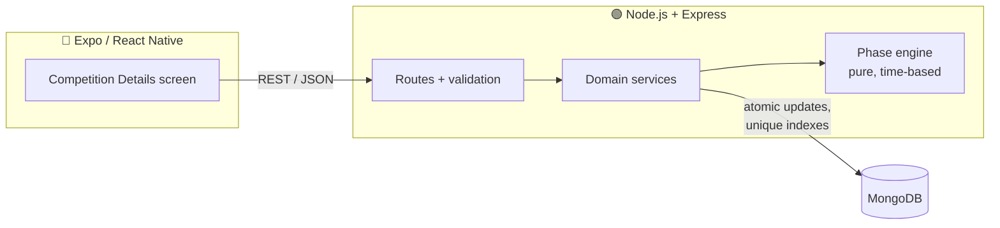
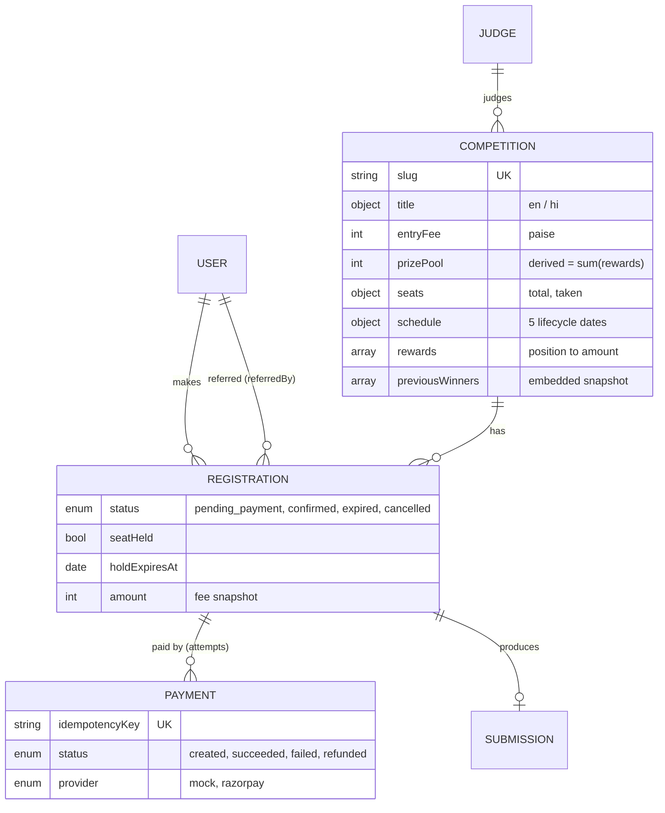
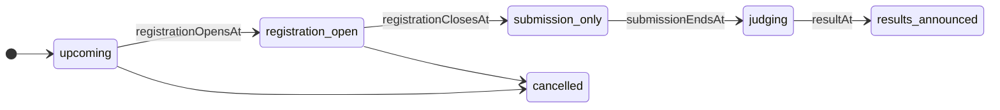
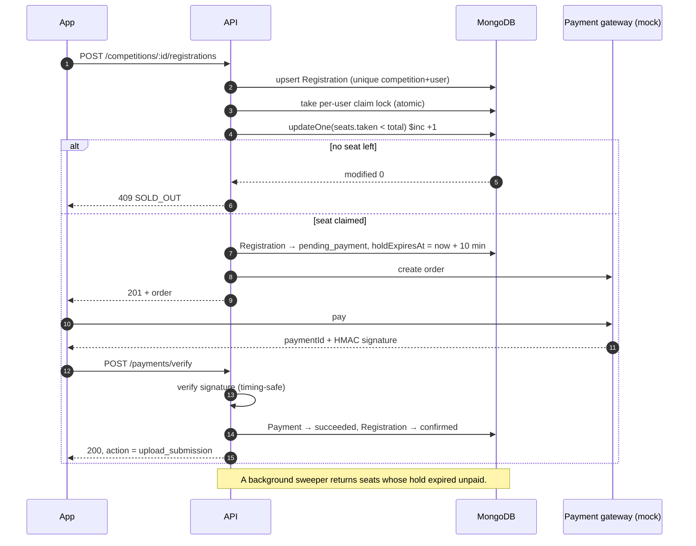

# Feedants Competition Platform

[](https://github.com/suyash503/feedants-competition-platform/actions/workflows/ci.yml)


A production-minded, full-stack **paid talent competition** module: a React Native (Expo) app,
backed by a Node.js + Express API and MongoDB. Users discover a competition, reserve one of a limited
number of seats, pay an entry fee, upload a performance video, and follow it through judging to results.

It started as the Feedants full-stack internship assignment ("build the Competition Details screen as a
real feature, not a static UI"). The goal here is to go further and treat it like a system that has to
survive **thousands of users hitting "Register" for the last seat at the same moment**.

> **Status:** 🚧 under active development. See the [roadmap](#roadmap).

---

## Why this is harder than it looks

| Problem | What goes wrong naively | How this project handles it |
|---|---|---|
| **Last-seat race** | Two requests both read "1 seat left", both register, the event is oversold | Seats are claimed with a single guarded atomic update (`taken < total` checked inside the write) |
| **Double taps / retries** | The same user gets two registrations or is charged twice | Unique index on `(competition, user)` and idempotency keys on payments |
| **Abandoned checkouts** | Seats locked forever by people who never paid | A seat is *held* with an expiry; unpaid holds are released automatically |
| **Stale status** | A stored `status: "open"` that nobody flips to closed at midnight | The lifecycle phase is **derived from the schedule** using server time, never stored |
| **Client clock tampering** | A user changes their phone's time to register late | The server decides; the client countdown is synced to the server's clock |
| **Money bugs** | `0.1 + 0.2` on currency | All amounts stored as integer paise |

## Architecture



### Data model



### Competition lifecycle

The phase is computed from dates by [`competitionPhase.js`](backend/src/domain/competitionPhase.js).
Registration and submission windows are allowed to overlap, so they are exposed as separate flags.



### Checkout: how a seat is taken safely



## API

Base URL `/api/v1`. Errors always look like `{ "error": { "code": "SOLD_OUT", "message": "..." } }`,
and the app switches on `code`.

| Method | Path | Auth | What it does |
|---|---|---|---|
| `GET` | `/competitions/:idOrSlug` | – | Public details: content, judge, rewards, dates, seats, current phase. Briefly cacheable |
| `GET` | `/competitions/:idOrSlug/availability` | – | Just seats + phase, cheap to poll for the live counter |
| `GET` | `/competitions/:idOrSlug/me` | ✓ | This user's registration, submission, **the CTA to show**, referral stats |
| `POST` | `/competitions/:idOrSlug/registrations` | ✓ | Reserve a seat and get a payment order (confirms instantly if free). Optional `referralCode` |
| `DELETE` | `/competitions/:idOrSlug/registrations/me` | ✓ | Give up an unpaid seat hold |
| `POST` | `/payments/verify` | ✓ | Verify the gateway's signature, confirm the registration. Idempotent |
| `PUT` | `/competitions/:idOrSlug/submission` | ✓ | Upload or replace the entry video (only when registered and the window is open) |
| `POST` | `/mock-gateway/checkout` | ✓ | Dev only: plays the payment SDK, `outcome: success \| failure` |
| `POST` | `/auth/dev-login` | – | Dev only: phone number in, JWT out |
| `GET` | `/health` | – | Liveness + DB status |

The `action.type` returned by `/me` is what the bottom button renders:

| `action.type` | Button |
|---|---|
| `register` | Register · ₹99 |
| `complete_payment` | Complete payment (hold expires in mm:ss) |
| `sold_out` | Competition full |
| `registration_not_open` / `registration_closed` | Opens on … / Registration closed |
| `submission_not_open` | Submissions open on … |
| `upload_submission` / `replace_submission` | Upload submission / Replace submission |
| `submission_missed` / `awaiting_results` | Submission window closed / Results on … |
| `view_results` / `cancelled` | View results / Competition cancelled |

## Tech stack

- **Mobile:** React Native with Expo
- **API:** Node.js 22+, Express
- **Database:** MongoDB 8 with Mongoose
- **Payments:** mock provider shaped like Razorpay orders/payments, so the real one can be swapped in
- **Validation & security:** zod, helmet, JWT, per-user rate limiting on writes
- **Testing:** `node:test` + supertest. Unit tests for the pure rules, integration and concurrency tests against a real MongoDB

## Testing

37 tests, run in CI against a real MongoDB on Node 22 and 24. Highlights from
[`concurrency.test.js`](backend/test/concurrency.test.js):

| Scenario | Guarantee checked |
|---|---|
| 200 users race for 20 seats | exactly 20 succeed, 180 get `SOLD_OUT`, counter = 20 |
| 50 users race for the **last** seat | exactly 1 wins |
| one user fires 10 parallel "Register" taps | 1 registration, 1 seat, 1 payment order |
| the same payment verified 5× at once | confirmed once, seat counted once |
| 60 users mixing register / pay / cancel | seat counter == registrations actually holding a seat |

Plus payment edge cases ([`payments.test.js`](backend/test/payments.test.js)): forged signatures, verifying
someone else's order, payment arriving after the hold expired (re-seated if possible, otherwise refunded),
and time-based rules driven by a controllable server clock instead of `sleep`.

## Project structure

```
backend/
  src/
    config/        env + database connection
    domain/        pure business rules: lifecycle phase, which CTA to show (+ unit tests)
    lib/           errors, clock, logger
    middleware/    auth, validation, rate limiting, error handling
    models/        Mongoose schemas, indexes, validation
    routes/        HTTP layer (thin)
    services/      registration, seats, payments, submissions
  scripts/seed.js  demo data covering every lifecycle state
  test/            integration + concurrency tests
mobile/
  src/
    app/           Expo Router routes only (thin files)
    api/           typed fetch client, response types, React Query hooks
    components/    shared UI kit (AppText, Card, Chip, ProgressBar...) + tab bar
    features/
      competition/ Competition Details + list screens, one component per section
      profile/     demo user switcher
    hooks/         server-synced countdown
    i18n/          English / हिंदी strings and language context
    lib/           money/date formatting, server clock, secure storage
    session/       dev sign-in session
    theme/         design tokens sampled from the design
```

## Mobile app

The Competition Details screen is built section by section from the design, and **every value on it comes
from the API**. Only the app's own UI labels live in the app.

| Concern | How it's handled |
|---|---|
| **Three data sources** | `GET /competitions/:slug` (content, cached a minute), `/availability` (seats + phase, polled every 10 s), `/me` (personal state + CTA). The screen shows whichever seats/phase snapshot is newest |
| **Countdown** | Ticks every second from a **server-synced clock** (offset measured on every response, latency-corrected). Changing the phone's time doesn't move it. When it hits zero the screen refetches, because the phase just changed |
| **Bottom CTA** | Renders the server's `action`. `describeAction()` only turns it into words |
| **States** | Loading skeletons that mirror the layout, offline / error with retry, 404, pull-to-refresh, sold out, upcoming, results, registered, payment pending |
| **Language** | ENG / हिंदी toggle switches UI labels *and* server content (which ships both languages) instantly, and the choice is remembered |
| **Small screens** | Money and the countdown never truncate. Rows wrap instead (checked at 375 px) |
| **Accessibility** | Roles, states and labels on the tabs, toggle, progress bar, timer and CTA |

The Profile tab switches between demo users (e.g. *Kavya*, who is already registered), so every per-user
state can be shown without touching the database.

## Getting started

### Backend

Requires Node.js 22+ and MongoDB (local or Atlas).

```bash
cd backend
cp .env.example .env      # set MONGODB_URI
npm install
npm run seed              # demo data: 5 competitions in different states
npm run dev               # http://localhost:4000
```

Then try it:

```bash
curl localhost:4000/api/v1/competitions/classical-dance
curl -X POST localhost:4000/api/v1/auth/dev-login -H "content-type: application/json" -d '{"phone":"+919000000001"}'
```

Seeded competitions: `classical-dance` (the design: open, 19 spots left), `bollywood-beats` (sold out),
`folk-fusion` (upcoming), `kathak-classics-july` (results out), `open-mic-dance` (free entry).

### Mobile

```bash
cd mobile
npm install
npx expo start            # press w for web, or scan the QR code with Expo Go
```

In development the app finds the API automatically on the machine serving the bundle (port 4000), so a
phone on the same Wi-Fi works with no setup. To point it elsewhere, set `EXPO_PUBLIC_API_URL`
(e.g. `EXPO_PUBLIC_API_URL=https://api.example.com`). On first launch it signs in as the seeded demo user.

### Tests

Tests use their own databases and never touch the dev one:

```bash
MONGODB_URI_TEST=mongodb://127.0.0.1:27017/feedants_test npm test
```

| Variable | Description | Default |
|---|---|---|
| `MONGODB_URI` | Mongo connection string | – (required) |
| `PORT` | API port | `4000` |
| `JWT_SECRET` | Token signing secret (required in production) | dev value |
| `ENABLE_DEV_LOGIN` | Enable phone-only dev login | `true` outside production |
| `PAYMENT_PROVIDER` | `mock` (Razorpay-shaped) | `mock` |
| `PAYMENT_MOCK_SECRET` | HMAC secret for mock signatures | dev value |
| `SEAT_HOLD_MINUTES` | How long a seat is held while paying | `10` |
| `HOLD_SWEEP_INTERVAL_MS` | How often expired holds are released | `30000` |
| `WRITE_RATE_LIMIT_PER_MINUTE` | Per-user limit on register/pay/submit | `30` |
| `REFERRAL_BASE_URL` | Prefix for referral links | `https://feedants.com/r/` |
| `CORS_ORIGIN` | Allowed origins, comma separated | `*` |

## Roadmap

- [x] Data model: schemas, indexes, validation, lifecycle phase engine
- [x] REST API: competition details, per-user state, register, mock pay, submit
- [x] Race-safe seat reservation with expiring holds
- [x] Seed data matching the design
- [x] Integration + concurrency test suite in CI
- [x] Expo app: Competition Details screen matching the design, from reusable components
- [x] Live countdown synced to server time, polled seat counter
- [x] English / हिंदी toggle
- [ ] In-app register → pay → upload flow, in-app video player
- [ ] Push-based live seat counter (SSE) instead of polling
- [ ] Load test: many concurrent users racing for the last seats
- [ ] Docker Compose for one-command local setup
- [ ] Demo video

## Assumptions, decisions and trade-offs

**Assumptions**
- "1 / 20 Booked" counts confirmed entries **and** seats currently held by someone paying. Otherwise the
  counter would show a seat as free that nobody else can actually take.
- Submissions may open before registration closes (the design shows exactly that), so the two windows are
  modelled as independent flags rather than one linear status.
- A referral earns the referrer ₹10 when the referred user **pays**, not when they merely start checkout.
- Paid registrations are not self-cancellable in the app. They go through the refund policy.
- Auth and video upload storage are outside the scope of this module: a dev phone login stands in for OTP,
  and submissions take a video URL (a pre-signed upload URL flow would feed it in production).

**Decisions**
- **Atomic counter instead of transactions.** Claiming a seat is one conditional `updateOne` on the
  competition. It needs no replica set, works at any concurrency, and is simple to reason about.
  Multi-step flows are ordered so a crash can only *leak* a seat (repairable with `reconcileSeats`),
  never oversell one.
- **Seat holds with expiry** (10 min) rather than "first to pay wins". Users are not charged for a seat that
  is gone by the time they finish paying.
- **The server decides the CTA.** `/me` returns an `action`, so business rules live in one tested pure
  function instead of being re-implemented in the app.
- **Phase is derived, never stored.** No cron job is needed to flip statuses, and it can't drift.
- **Public vs personal endpoints.** Details are user-independent and CDN-cacheable for a few seconds;
  personal state is a separate small request. This keeps the hot path cheap at high traffic.
- **Money in paise, prize pool derived from the rewards**, so the displayed total can never disagree with the breakdown.

**Trade-offs**
- All registrations for one competition update one document (the seat counter). MongoDB handles thousands
  of such writes per second. For a flash sale with far more demand than that, the counter could be sharded
  into buckets or fronted by a Redis queue.
- The expired-hold sweeper polls every 30 s, so an abandoned seat can look taken for up to a
  hold length + 30 s. A TTL-driven queue would tighten that.
- The rate limiter's store is in memory, which is fine on one instance but needs Redis behind a load balancer.

**What I'd add for production:** real OTP auth, Razorpay with webhooks (for payments whose verify call
never arrives), pre-signed S3/GCS video uploads with transcoding, Redis for caching and rate limits,
OpenAPI docs, metrics and alerting, and an admin panel for creating competitions.

## License

[MIT](LICENSE) © Suyash Singh
